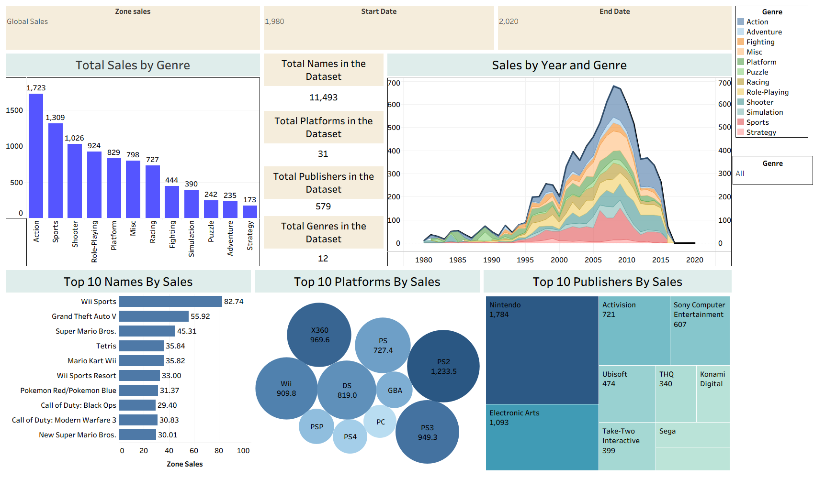

# 🎮 Video Game Sales Dashboard

This project presents an interactive dashboard built in **Tableau** to explore and analyze global video game sales across genres, platforms, publishers, and time. It leverages a comprehensive dataset containing over 11,000 titles, from 1980 to 2020.

---

## 📊 Dashboard Features

- **Total Sales by Genre**: Visual comparison of game genres like Action, Sports, Shooter, etc.
- **Sales Over Time**: Area chart showing trends in sales volume by genre across decades.
- **Top 10 Games by Sales**: Highlight of the best-selling individual games.
- **Top Platforms**: Platforms with highest cumulative sales (e.g., PS2, Wii, DS).
- **Top Publishers**: Treemap showing publishers ranked by total global sales.

---

## 🧰 Tools Used

- **Tableau Public / Desktop**
- Dataset (CSV format)
- Excel / Power BI (for pre-processing, if needed)

---

## 📌 Key Insights

- **Action, Sports, and Shooter** games dominate total global sales.
- **Nintendo**, **Electronic Arts**, and **Activision** are top-performing publishers.
- The peak of game sales occurred between **2005–2010**.
- Consoles like **PS2**, **X360**, and **Wii** contributed significantly to the gaming boom.

---

## 💡 Business Impact

- Offers insights for game developers and publishers on what sells best.
- Assists marketing teams in identifying key platforms and genres to target.
- Helps stakeholders understand market evolution and publisher dominance over time.

---

## 📁 Files

| File Name | Description |
|-----------|-------------|
| `Video Games Sales Dashboard.twb` | Tableau workbook |
| `Dashboard.png` | Static dashboard preview image |

---

## 👨‍💻 Author

**Nandini Nehra**  
B.E ECE | Data Analyst Enthusiast  
🔗 [LinkedIn]([https://www.linkedin.com/in/aditya-pathania-ba32b5261/](https://www.linkedin.com/in/nandini-nehra-635b45257/))  
📁 [Portfolio](https://datascienceportfol.io/Nandini_Nehra)

---

### 📸 Dashboard Preview

---
